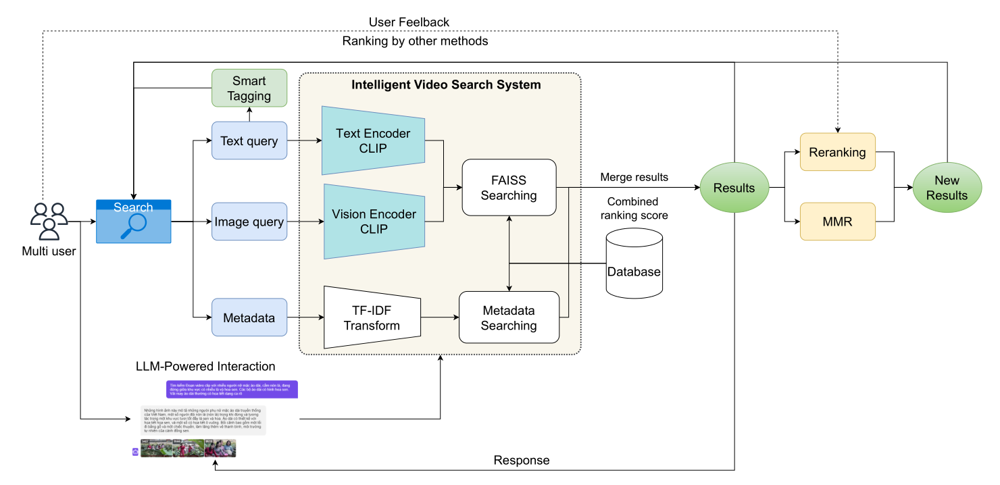
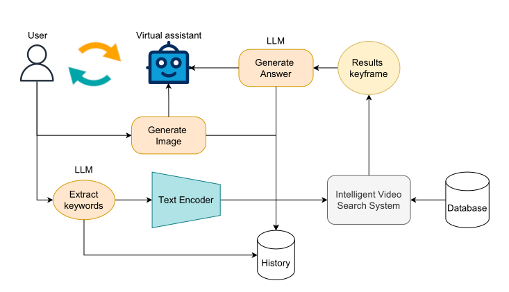

# LLM-Powered Video Search: A Comprehensive Multimedia Retrieval System

<p align="center">
  <em>An intelligent video retrieval system leveraging Large Language Models (LLMs) and multimodal search, developed for the AIC2024 competition and accepted at the international SOICT 2024 conference.</em>
</p>


<details>
  <summary>Table of Contents</summary>

  - [📍 Overview](#-overview)
  - [🎯 Features](#-features)
  - [🤖 Tech Stack](#-tech-stack)
  - [🚀 Setup and Usage](#-setup-and-usage)
  - [🎬 Demo](#-demo)
  - [👣 Workflow](#-workflow)
  - [📐 App Structure](#-app-structure)
  - [🧑‍💻 Contributors](#-contributors)

</details>

## 📍 Overview 
The `LLM-Powered Video Search System` is an advanced multimodal video search solution that leverages Large Language Models (LLMs) to enhance video retrieval through text, image, and metadata queries. This project was developed for the [AIC2024](https://aichallenge.hochiminhcity.gov.vn/) competition and has been accepted at the international [SOICT 2024](https://soict.org/) conference, aiming to provide an intelligent and efficient video search system. Details about the paper can be found on [Springer](https://www.springer.com/).

## 🎯 Features

1. **Multimodal Search Capabilities**
   - **Text-based search:** Supports ASR (Automatic Speech Recognition), OCR, captions, and descriptive image queries for improved accuracy.
   - **Image-based search:** Enables users to find specific video segments based on images.
   - **Metadata-based search:** Provides a 7x7 matrix for tagging objects and color attributes for contextual search.

2. **LLM-Powered Interaction**
   - Integrates LLMs (e.g., GPT-4) to handle natural language queries and deliver relevant search results tailored to the context.

3. **User-Friendly Interface**
   - A responsive user interface allows users to view results as keyframes or full video segments and interact with detailed metadata.

## 🤖 Tech Stack

- **Back-end**: Django
- **Core Technologies**: CLIP, Faiss, TFIDF
- **Supporting Technologies**: OpenCV, PyTorch, Transformers
- **Development Tools**: Docker, Git, Jupyter Notebook

## 🚀 Setup and Usage

1. **Clone Repository**
   ```bash
   git clone https://github.com/xndien2004/LLM_Powered_Video_Search.git
   cd AIC2024
   ```

2. **Install Dependencies**
   Ensure Python and Django are installed. Then, install other dependencies from `requirements.txt`:

   ```bash
   pip install -r requirements.txt
   ```

3. **Configure `MEDIA_ROOT`**
   Open [settings.py](./AIC/settings.py) in the `AIC/` folder and set `MEDIA_ROOT` to point to your local `media` directory:

   ```python
   MEDIA_ROOT = '/path/to/your/media'
   ```
   You can download the dataset from [Google Drive](https://drive.google.com/drive/folders/17Yab4iMAEzok0pO_czgbAkKBlaQ2ptqU) or [Kaggle](https://www.kaggle.com/datasets/tienanh2003/keyframes-v1-aic2024).

   Media for the app should be stored in the `media` directory. The structure should be as follows:
   <details>
   <summary>Media format</summary>
   ```
   media/
   ├── contexts_bin/
   │   ├── npz/
   │   │   ├── sparse_context_matrix_asr.npz
   │   │   ├── sparse_context_matrix_caption.npz
   │   │   ├── sparse_context_matrix_number_tag.npz
   │   │   ├── sparse_context_matrix_number.npz
   │   │   ├── sparse_context_matrix_ocr.npz
   │   │   ├── sparse_context_matrix_synthetic.npz
   │   │   ├── sparse_context_matrix_tag.npz
   │   ├── pkl/
   │   │   ├── tfidf_transform_asr.pkl
   │   │   ├── tfidf_transform_caption.pkl
   │   │   ├── tfidf_transform_number_tag.pkl
   │   │   ├── tfidf_transform_number.pkl
   │   │   ├── tfidf_transform_ocr.pkl
   │   │   ├── tfidf_transform_synthetic.pkl
   │   │   ├── tfidf_transform_tag.pkl
   ├── faiss/
   │   ├── faiss_openclip.bin
   │   ├── ...
   ├── Keyframes/
   │   ├── Keyframes_L01/keyframes/
   │   │   ├── L01_V001/
   │   │   │   ├── 001.jpg
   │   │   │   ├── 002.jpg
   │   │   │   ├── ...
   │   ├── ...
   ├── map-keyframes/
   │   ├── L01_V001.csv
   │   ├── L01_V002.csv
   │   ├── ...
   ├── media-info/
   │   ├── L01_V001.json
   │   ├── L01_V002.json
   │   ├── ...
   ├── tag/
   │   ├── tag_corpus.txt
   ├── id2img_fps_extra.json
   ├── id2img_fps.json
   ├── id2video.json
   ├── map-asr.json

   ```
   </details>

4. **Verify Paths in `viewAPI.py`**
   Ensure paths in `app/viewAPI.py` are correct.

5. **Run Migrations**
   Update the database with migrations:

   ```bash
   python manage.py migrate
   ```

6. **Run the Application**
   To start the application, use:

   ```bash
   python manage.py runserver
   ```

   The app will run by default at `http://127.0.0.1:8000/`.

## 🎬 Demo

- **Screenshots**: 

## 👣 Workflow

- **Data Processing**: Video data is processed using ASR or extracted via TransnetV2, then converted into image features and metadata.

- **LLM Powered Interaction**: Natural language queries are processed by the LLM and combined with image features and metadata for relevant video retrieval.



## 📐 App Structure
```
├── LLM_Powered_Video_Search/
│   ├── AIC/
│   │   ├── settings.py
│   ├── app/
│   │   ├── admin.py
│   │   ├── data_utils.py
│   │   ├── migrations/
│   │   ├── static/
│   │   ├── templates/
│   │   ├── viewAPI.py 
│   ├── data_extraction/
│   │   ├── TransnetV2/
│   │   ├── audio/
│   │   ├── metadata/
│   ├── docker-compose.yml
│   ├── figs/
│   ├── manage.py
│   ├── requirements.txt
│   ├── utils/
│       ├── LLM/
│       ├── video_retrieval/
│       ├── faiss_search.py
│       ├── combine_search.py
|       |...
```

## 🧑‍💻 Contributors

- [Trần Xuân Diện](https://github.com/dienlamAI)
- [Hoàng Tiến Anh](https://github.com/HTAnh2003)
- [Dương Văn Tài](https://github.com/TaiDuongRepo)
